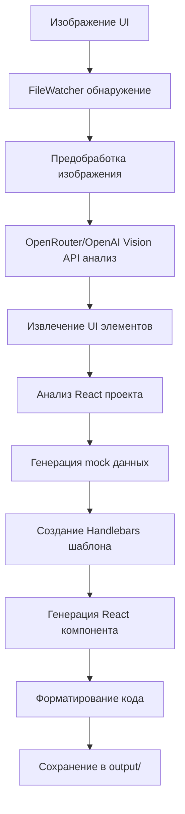

# React Component Generator v0.1.0

Автоматическая генерация React компонентов из изображений UI элементов с использованием Computer Vision и AI.

## 🚀 Возможности

- **Автоматическое распознавание UI элементов** - детекция кнопок, полей ввода, карточек, таблиц и других элементов
- **Поддержка React 18** - современная версия с TypeScript
- **TypeScript поддержка** - автоматическая генерация типов и интерфейсов
- **Интеграция с UI библиотеками** - Material-UI, Ant Design, Chakra UI, Bootstrap
- **Различные подходы к стилизации** - CSS, SCSS, styled-components, Emotion, Tailwind
- **Генерация mock данных** - реалистичные данные для тестирования
- **Веб-интерфейс** - удобное управление через браузер
- **Real-time уведомления** - отслеживание процесса обработки через WebSocket
- **Batch обработка** - загрузка нескольких изображений одновременно
- **Поддержка OpenRouter API** - альтернатива OpenAI для регионов с ограничениями

## 🔄 Как это работает

### 1. Процесс обработки изображения



### 2. Детальный workflow

**Шаг 1: Обнаружение файла**
- FileWatcher следит за папкой `incoming/`
- При появлении нового изображения создается задача в очереди
- Статус: `queued` → `processing`

**Шаг 2: Анализ изображения**
- Изображение предобрабатывается (изменение размера, улучшение качества)
- Отправляется в OpenRouter/OpenAI Vision API с промптом для анализа UI
- API возвращает структурированные данные об элементах:
  ```json
  {
    "elements": [
      {
        "type": "button",
        "bbox": [100, 200, 200, 240],
        "text": "Click me",
        "properties": {
          "backgroundColor": "#1976d2",
          "textColor": "#ffffff"
        }
      }
    ]
  }
  ```

**Шаг 3: Анализ проекта**
- Система анализирует `package.json` в папке `packages/`
- Определяет версию React, TypeScript, UI библиотеки
- Настраивает параметры генерации

**Шаг 4: Генерация mock данных**
- Faker.js создает реалистичные данные для компонента
- Адаптирует данные под тип UI элемента
- Генерирует props и state

**Шаг 5: Генерация компонента**
- Handlebars шаблоны рендерят React код
- Создаются файлы: `.tsx`, `.css`, `.types.ts`, `.stories.tsx`, `.test.tsx`, `.md`
- Prettier форматирует код
- ESLint проверяет на ошибки

**Шаг 6: Сохранение результата**
- Все файлы сохраняются в `output/ComponentName/`
- Статус: `completed`
- WebSocket уведомляет клиентов

### 3. Поддерживаемые UI элементы

| Тип элемента | Описание | Генерируемые props |
|--------------|----------|-------------------|
| `button` | Кнопки | `onClick`, `disabled`, `variant` |
| `input` | Поля ввода | `onChange`, `placeholder`, `type` |
| `text` | Текстовые элементы | `children`, `variant` |
| `image` | Изображения | `src`, `alt`, `width`, `height` |
| `card` | Карточки | `title`, `content`, `actions` |
| `table` | Таблицы | `data`, `columns`, `onRowClick` |
| `form` | Формы | `onSubmit`, `validation` |
| `navigation` | Навигация | `items`, `orientation` |

### 4. Интеграция с UI библиотеками

**Material-UI:**
```tsx
import { Button, TextField } from '@mui/material';
// Автоматически генерируется с MUI компонентами
```

**Ant Design:**
```tsx
import { Button, Input } from 'antd';
// Использует Ant Design компоненты
```

**Styled Components:**
```tsx
const StyledButton = styled.button`
  background-color: ${props => props.primary ? '#1976d2' : '#fff'};
`;
```

### 5. Real-time мониторинг

**WebSocket события:**
- `file-added` - новый файл добавлен
- `queue-updated` - обновление очереди
- `processing-started` - начата обработка
- `processing-completed` - обработка завершена
- `processing-failed` - ошибка обработки

**Статистика в реальном времени:**
- Количество обработанных файлов
- Процент успешности
- Среднее время обработки
- Активные задачи

## 📋 Требования

- Node.js 18+ 
- npm или yarn
- OpenAI API ключ ИЛИ OpenRouter API ключ (для анализа изображений)

## 🛠 Установка

1. **Клонирование репозитория**
```bash
git clone <repository-url>
cd pic2react
```

2. **Установка зависимостей**
```bash
npm install
cd web-ui
npm install
cd ..
```

3. **Настройка переменных окружения**
```bash
cp env.example .env
```

Отредактируйте `.env` файл:
```env
OPENAI_API_KEY=your_openai_api_key_here
PORT=3001
NODE_ENV=development
```

4. **Запуск приложения**
```bash
# Терминал 1 - Backend (порт 3001)
npm run dev

# Терминал 2 - Frontend (порт 3000)
cd web-ui
npm run dev
```

**Доступные адреса:**
- **Frontend**: http://localhost:3000
- **Backend API**: http://localhost:3001/api
- **Предпросмотр output**: http://localhost:3001/output/

## ⚡ Быстрый старт

### 1. Первый запуск

```bash
# 1. Установка зависимостей
npm install && cd web-ui && npm install && cd ..

# 2. Настройка API ключа
echo "OPENAI_API_KEY=your_key_here" > .env

# 3. Запуск системы
npm run dev
```

### 2. Тестирование системы

**Шаг 1: Проверка работы**
```bash
# Проверка API
curl http://localhost:3001/api/health

# Проверка веб-интерфейса
open http://localhost:3000
```

**Шаг 2: Загрузка тестового изображения**
```bash
# Создайте скриншот кнопки или UI элемента
# Поместите в папку incoming/
cp your-ui-screenshot.png incoming/
```

**Шаг 3: Просмотр результата**
- Откройте http://localhost:3000 - основной веб-интерфейс
- Откройте http://localhost:3001/output/ - предпросмотр output
- Перейдите в раздел "Компоненты"
- Просмотрите сгенерированный код

**Шаг 4: Мониторинг логов**
```bash
# В отдельном терминале
tail -f logs/app.log

# Или через веб-интерфейс
open http://localhost:3000
```

### 3. Примеры использования

**Генерация кнопки:**
1. Сделайте скриншот кнопки
2. Загрузите через веб-интерфейс
3. Получите готовый React компонент с TypeScript

**Генерация формы:**
1. Загрузите макет формы с полями ввода
2. Система определит все поля автоматически
3. Сгенерирует форму с валидацией

**Batch обработка:**
1. Загрузите несколько изображений одновременно
2. Система обработает их последовательно
3. Получите набор связанных компонентов

## 🎯 Использование

### 1. Веб-интерфейс

Откройте http://localhost:3000 в браузере

**Основные функции:**
- Загрузка изображений через drag & drop
- Выбор React проекта для анализа
- Просмотр очереди обработки
- Просмотр и скачивание сгенерированных компонентов

### 2. Предпросмотр результатов

**Статические файлы доступны по адресу:**
- http://localhost:3001/static/ - просмотр сгенерированных компонентов
- http://localhost:3001/output/ - предпросмотр output с веб-интерфейсом
- http://localhost:3001/web-ui/ - веб-интерфейс (альтернативный доступ)

**Структура output:**
```
output/
├── Button/                 # Сгенерированный компонент
│   ├── Button.tsx         # React компонент
│   ├── Button.css         # Стили
│   ├── Button.types.ts    # TypeScript типы
│   ├── Button.stories.tsx # Storybook stories
│   ├── Button.test.tsx    # Jest тесты
│   └── Button.md          # Документация
└── Card/
    └── ...
```

### 3. Логи обработки

**Логи доступны в папке `logs/`:**
- `logs/app.log` - все логи приложения
- `logs/error.log` - только ошибки
- `logs/exceptions.log` - необработанные исключения
- `logs/rejections.log` - отклоненные промисы

**Просмотр логов в реальном времени:**
```bash
# Все логи
tail -f logs/app.log

# Только ошибки
tail -f logs/error.log

# Логи с фильтрацией
grep "ERROR" logs/app.log
grep "Vision analysis" logs/app.log

# Мониторинг в реальном времени с цветами
tail -f logs/app.log | grep --color=always -E "(ERROR|WARN|INFO|DEBUG)"

# Логи только для обработки изображений
tail -f logs/app.log | grep -E "(FileWatcher|Vision|Generator)"
```

**Примеры логов:**
```
[2024-01-20 10:30:15] INFO: FileWatcher запущен для папки: ./incoming
[2024-01-20 10:30:20] INFO: Обнаружен новый файл: button-screenshot.png
[2024-01-20 10:30:21] INFO: Начинаем анализ изображения: button-screenshot.png
[2024-01-20 10:30:25] INFO: Анализ завершен для: button-screenshot.png
[2024-01-20 10:30:26] INFO: Проект проанализирован: my-react-app (React 18)
[2024-01-20 10:30:27] INFO: Компонент сгенерирован: Button
[2024-01-20 10:30:28] INFO: Компонент сохранен в: ./output/Button
```

### 2. Автоматическая обработка

Поместите изображения в папку `incoming/` - они будут обработаны автоматически:

```bash
# Пример
cp your-ui-screenshot.png incoming/
```

### 3. Анализ React проектов

Поместите React проекты в папку `packages/` для автоматического анализа зависимостей:

```
packages/
├── my-react-app/
│   ├── package.json
│   └── src/
└── another-project/
    ├── package.json
    └── src/
```

## 📁 Структура проекта

```
react-component-generator/
├── core/                   # Основная логика
│   ├── fileWatcher.js     # Мониторинг файлов
│   ├── visionAnalyzer.js  # Computer Vision анализ
│   ├── projectAnalyzer.js # Анализ React проектов
│   ├── codeGenerator.js   # Генерация кода
│   └── mockGenerator.js   # Генерация mock данных
├── templates/              # Handlebars шаблоны
│   ├── react16/           # React 16.x шаблоны
│   ├── react17/           # React 17.x шаблоны
│   ├── react18/           # React 18.x шаблоны
│   └── react19/           # React 19.x шаблоны
├── web-ui/                 # React веб-интерфейс
│   ├── src/
│   ├── public/
│   └── package.json
├── incoming/               # Входящие изображения
├── packages/               # React проекты для анализа
├── processed/              # Обработанные данные
├── output/                 # Результаты генерации
└── config/                 # Конфигурация
    ├── vision.json        # Настройки CV
    ├── templates.json     # Настройки шаблонов
    └── ui-libraries.json  # UI библиотеки
```

## ⚙️ Конфигурация

### Настройки Vision API

`config/vision.json`:
```json
{
  "models": {
    "openai": {
      "apiKey": "${OPENAI_API_KEY}",
      "model": "gpt-4-vision-preview",
      "maxTokens": 4096
    }
  },
  "preprocessing": {
    "resize": true,
    "maxWidth": 1920,
    "denoise": true
  }
}
```

### Настройки UI библиотек

`config/ui-libraries.json`:
```json
{
  "mui": {
    "name": "Material-UI",
    "imports": {
      "Button": "@mui/material/Button",
      "TextField": "@mui/material/TextField"
    }
  }
}
```

## 🔧 API

### Endpoints

- `GET /api/projects` - список React проектов
- `POST /api/images/upload` - загрузка изображений
- `GET /api/images/status/:id` - статус обработки
- `POST /api/generate` - запуск генерации
- `GET /api/components/:id` - получение результата
- `GET /api/health` - проверка здоровья системы

### WebSocket

- `/realtime` - real-time уведомления о статусе обработки

## 📝 Примеры использования

### Генерация кнопки

1. Сделайте скриншот кнопки
2. Загрузите в `incoming/` или через веб-интерфейс
3. Получите готовый React компонент:

```tsx
import React from 'react';

interface ButtonProps {
  children: React.ReactNode;
  onClick?: () => void;
}

const Button: React.FC<ButtonProps> = ({ children, onClick }) => {
  return (
    <button 
      className="button"
      onClick={onClick}
      style={{
        backgroundColor: '#1976d2',
        color: 'white',
        border: 'none',
        borderRadius: '4px',
        padding: '8px 16px'
      }}
    >
      {children}
    </button>
  );
};

export default Button;
```

### Генерация формы

1. Загрузите макет формы
2. Система автоматически определит поля ввода
3. Сгенерирует компонент с валидацией

## 🧪 Тестирование

```bash
# Запуск тестов
npm test

# Линтинг
npm run lint

# Форматирование кода
npm run format
```

## 📊 Мониторинг и отладка

### 1. Веб-интерфейс мониторинга

**Дашборд (http://localhost:3000):**
- Статистика обработки в реальном времени
- Очередь задач с статусами
- Просмотр сгенерированных компонентов
- Настройки системы

**Мониторинг логов через веб-интерфейс:**
- Real-time обновления через WebSocket
- Цветовая индикация статусов задач
- Фильтрация по типам событий
- Экспорт логов в файл

**API Health Check:**
```bash
curl http://localhost:3001/api/health
```

### 2. Логи системы

**Структура логов:**
```
logs/
├── app.log          # Все логи приложения
├── error.log        # Только ошибки
├── exceptions.log   # Необработанные исключения
└── rejections.log   # Отклоненные промисы
```

**Уровни логирования:**
- `ERROR` - критические ошибки
- `WARN` - предупреждения
- `INFO` - информационные сообщения
- `DEBUG` - отладочная информация

### 3. Предпросмотр результатов

**Статические файлы:**
- http://localhost:3001/static/ - сгенерированные компоненты
- http://localhost:3001/output/ - веб-интерфейс предпросмотра
- Прямой доступ к файлам через браузер
- Возможность скачивания ZIP архивов

**Веб-интерфейс предпросмотра:**
- Автоматическое обновление каждые 5 секунд
- Список всех сгенерированных компонентов
- Просмотр файлов каждого компонента
- Кнопки скачивания

**Структура output:**
```
output/
├── Button/
│   ├── Button.tsx         # React компонент
│   ├── Button.css         # Стили
│   ├── Button.types.ts    # TypeScript типы
│   ├── Button.stories.tsx # Storybook stories
│   ├── Button.test.tsx    # Jest тесты
│   └── Button.md          # Документация
└── Card/
    └── ...
```

### 4. WebSocket мониторинг

**Подключение к WebSocket:**
```javascript
const socket = io('http://localhost:3001');

socket.on('file-added', (fileInfo) => {
  console.log('Новый файл:', fileInfo);
});

socket.on('queue-updated', (data) => {
  console.log('Очередь обновлена:', data);
});

socket.on('processing-completed', (result) => {
  console.log('Обработка завершена:', result);
});
```

### 5. Отладка проблем

**Проверка статуса системы:**
```bash
# Проверка портов
netstat -tulpn | grep :3001
netstat -tulpn | grep :3000

# Проверка процессов
ps aux | grep node

# Проверка логов
tail -f logs/app.log | grep ERROR
```

**Частые проблемы:**
1. **OpenAI API недоступен** - проверьте API ключ и баланс
2. **Файлы не обрабатываются** - проверьте права доступа к папкам
3. **Ошибки генерации** - проверьте совместимость версий React
4. **WebSocket не работает** - проверьте настройки CORS

## 🚨 Устранение неполадок

### OpenAI API ошибки
- Проверьте правильность API ключа
- Убедитесь в наличии средств на счету
- Проверьте лимиты API

### Проблемы с обработкой
- Проверьте формат изображения (PNG, JPG, JPEG, WEBP)
- Убедитесь, что размер файла не превышает 50MB
- Проверьте логи в папке `logs/`

### Ошибки генерации
- Убедитесь, что выбран правильный React проект
- Проверьте совместимость версий
- Проверьте настройки шаблонов

## 🤝 Вклад в проект

1. Fork репозитория
2. Создайте feature branch
3. Внесите изменения
4. Добавьте тесты
5. Создайте Pull Request

## 📄 Лицензия

MIT License - см. файл [LICENSE](LICENSE)

## 📋 TODO Список

### 🔥 Критические задачи
- [ ] **Исправить ошибки Handlebars шаблонов** - решить проблему с парсингом `height:h}}px'`
- [ ] **Стабилизировать генерацию компонентов** - обеспечить стабильную работу с различными типами UI элементов
- [ ] **Добавить обработку ошибок Vision API** - улучшить обработку ошибок от OpenRouter/OpenAI

### 🚀 Высокий приоритет
- [ ] **Добавить поддержку Material-UI компонентов** - интеграция с MUI компонентами
- [ ] **Улучшить точность анализа изображений** - оптимизировать промпты для Vision API
- [ ] **Добавить тесты** - unit тесты для core модулей
- [ ] **Создать предпросмотр компонентов** - интерактивный предпросмотр в веб-интерфейсе

### 📈 Средний приоритет
- [ ] **Добавить поддержку дополнительных UI библиотек** - Ant Design, Chakra UI, Bootstrap
- [ ] **Улучшить UI/UX веб-интерфейса** - современный дизайн и лучший UX
- [ ] **Добавить экспорт в различные форматы** - ZIP, GitHub репозитории
- [ ] **Оптимизировать производительность** - кэширование, параллельная обработка

### 🔧 Технические улучшения
- [ ] **Добавить поддержку React 16/17** - обратная совместимость
- [ ] **Улучшить логирование** - структурированные логи, метрики
- [ ] **Добавить конфигурацию через UI** - настройка через веб-интерфейс
- [ ] **Создать Docker контейнер** - упрощение развертывания

### 🎯 Долгосрочные цели
- [ ] **Интеграция с популярными IDE** - VS Code, WebStorm расширения
- [ ] **Добавить CI/CD** - автоматическое тестирование и развертывание
- [ ] **Создать API документацию** - Swagger/OpenAPI спецификация
- [ ] **Добавить мониторинг** - Prometheus, Grafana дашборды

### 🐛 Известные баги
- [ ] Handlebars шаблон генерирует ошибку парсинга при определенных данных
- [ ] Некоторые модели OpenRouter недоступны в определенных регионах
- [ ] Требуется дополнительная настройка для стабильной работы с различными типами UI элементов

---

## 📞 Поддержка

- Создайте issue для сообщения об ошибках
- Используйте Discussions для вопросов
- Проверьте документацию в папке `docs/`

---

**Создано с ❤️ для автоматизации разработки React приложений**